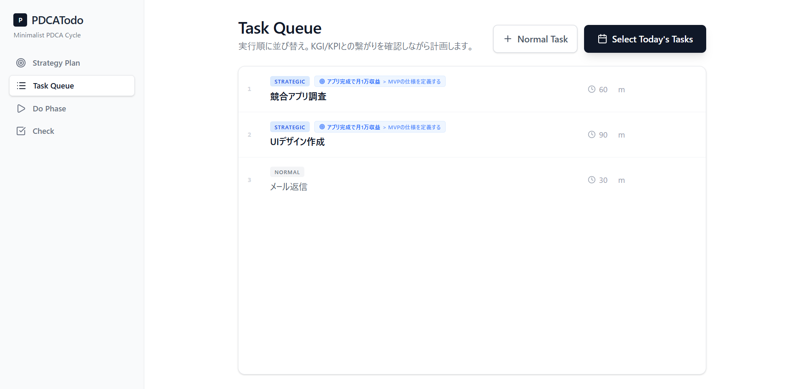
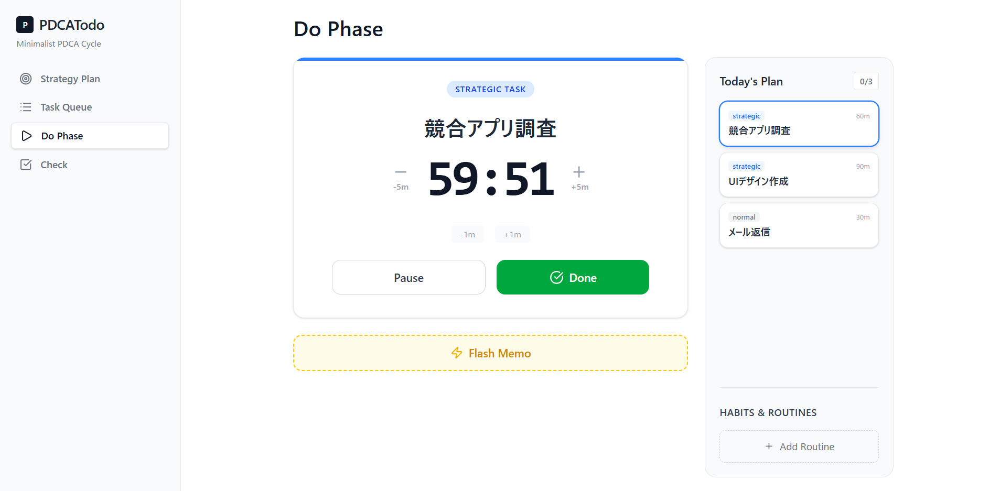
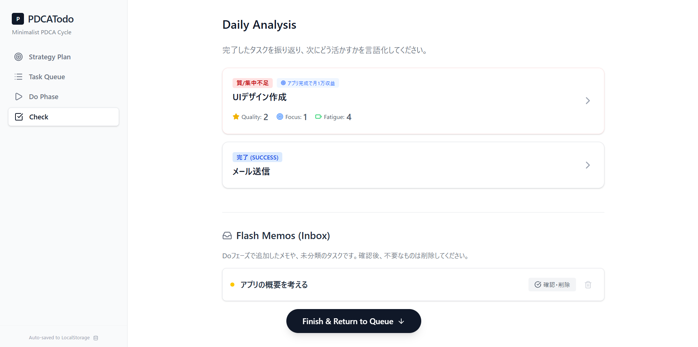

# PDCATodo - 思考の質を最大化する戦略的タスク管理システム

---

## Demo App

→ **https://tahought.github.io/app_pdca/**

(※ データはブラウザの LocalStorage に保存されます。外部サーバーへの送信は行われません)

---

##  概要 (Overview)

「ただタスクを消化するのではなく、目標（ゴール）に向かって着実に進むためのプラットフォーム」

PDCATodoは、冨田和正さんの「超鬼速PDCA」の本の内容をベースに設計された、自己変革のための戦略的タスク管理アプリです。

目の前の作業に忙殺されがちな現代において、常に**「大きな目標（KGI）」を見失わず、それを達成するための中間指標である「KPI」、そして具体的な解決策である「タスク」**へと論理的に落とし込むプロセスを一元管理します。  
日々の実行（Do）と深い内省（Check）を繰り返すことで、目標達成への最短ルートを走り続けることを支援します。

---

##  スクリーンショット (Screenshots)

1. Strategic Planning (Plan)  

2. Select-task (Do)  

3. Focus & Do (Do)  

4. Deep Analysis (Check)

---

### KGI/KPIツリー構造

KGI（最終目標）から逆算し、KPIとタスクをグリッドUIで俯瞰・構造化します。

### 実行の質の記録

時間を測る代わりに、完了直後の「質・集中度・疲労度」を直感的にログします。

### 思考ガイドによる内省

「思考ガイド」に従って要因を深く考え、次なるアクションを言語化します。

<!-- ※ imagesフォルダを作成し、実際のスクリーンショット画像を配置してください -->

---

##  特徴とこだわり (Features & Philosophy)

### 1. KGI/KPI 起点の戦略的プランニング

「何をするか（ToDo）」の前に、「何のためにやるか（KGI/KPI）」を明確にします。  
本アプリの Plan Strategy 画面では、  
**目標（KGI） > 中間目標（KPI） > タスク**  
という階層構造を可視化。  
アコーディオン形式のカードUIにより、全体像を俯瞰しつつ管理がスムーズに行えます。

### 2. 実績時間計測の「完全排除」と「質の追求」

多くのPDCAツールが求める「何分かかったか」という記録を排除。  
代わりに、タスク完了直後に  
- 質（Quality）  
- 集中度（Focus）  
- 疲労度（Fatigue）  
を直感的に記録し、定性的な成果を可視化します。

### 3. 「思考」を強制する Daily Analysis (Check)

完了したタスクに対しても**「思考ガイド」**が表示されます。

- 失敗時：なぜ未達だったか？（行動不足？計画ミス？）  
- 成功時：なぜうまくいったか？（再現性は？横展開できるか？）

自由記述エリアのみにすることで、ユーザー自身の言葉で「気づき」を言語化します。  
**これを入力して初めてタスクが消える仕組みです。**

### 4. 実行を妨げない「Flash Memo (Inbox)」

作業中に思いついたタスクを1秒で放り込めるメモ機能。  
Doフェーズに常設されており、集中力を途切れさせません。

---

##  使い方 (How to Use)

アプリは以下の4つのフェーズを循環させて使います。

### 1. Plan Strategy（戦略策定）

- **KGI設定**：「New Goal」で最終目標と期限を設定  
- **KPI設定**：KGIに必要な中間目標を追加  
- **タスク追加**：KPIを達成するための行動を追加  

### 2. Task Queue（計画調整）

- 今日のタスク選択  
- 優先順位の整理  
- 「Start Do Phase」で実行フェーズに移行  

### 3. Do Phase（実行・記録）

- タスク実行  
- 完了時に「質・集中度・疲労度」を5段階で評価  
- Flash Memoで即時メモ  

### 4. Check（内省・分析）

- 要因分析  
- 気づきを言語化  
- 入力完了後、タスクを消し込み  

---

##  開発の経緯 (Background)

多くのタスク管理ツールが長続きしない理由が  
**「記録作業の面倒さ」と「振り返りをしないこと」**  
であると気づいたことが本アプリの原点。

自分に本当に必要な機能だけを残し、  
**「目標達成への執着心」×「運用の手軽さ」**  
を両立させるために設計しました。

---

## 🛠 使用技術 (Tech Stack)

- **Frontend**: React (Functional Components, Hooks)  
- **Language**: TypeScript  
- **Styling**: Tailwind CSS  
- **Icons**: Lucide React  
- **Build Tool**: Vite  
- **State Management**: React Hooks (useState, useEffect, useMemo)  
- **Storage**: LocalStorage API  

---

##  開発期間 (Development Period)

- 開発期間: **2025.11.01 ~ 2025.11.19（約25時間）**  

